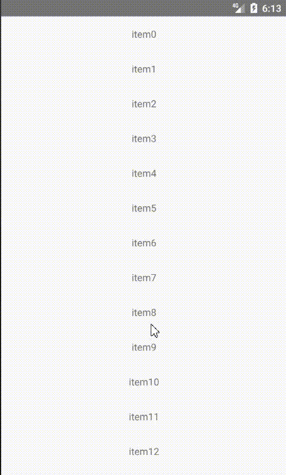

# react-native-sf-listview

# react-native 列表



# 安装
* npm i react-native-sf-list

# Props
|  parameter  |  type  |  required  |   description  |  default  |
|:-----|:-----|:-----|:-----|:-----|
|onLoad|func|no|上拉加载|null|
|onRefresh|func|no|下拉刷新|null|
|renderItem|func|no|列表子组件|null|
|showBackGround|boolean|no|是否显示无数据背景|false|
|sepline|func|no|分割线样式|null|
|header|func|no|列表头部样式|null|
|nodata_message|string|no|无数据提示|暂无数据|
|scrollEnabled|boolean|no|是否可以滚动|true|
|columns|number|no|每行元素的列数|1|
|no_data_img|number|no|无数据提示图片|null|
|indicator_color|string|no|加载圈颜色|#00AEF3|

# Methods
|  Methods  |  Params  |  Param Types  |   description  |  Example  |
|:-----|:-----|:-----|:-----|:-----|
|setRefreshing|visible|boolean|是否显示加载|this.listview.setRefreshing(true)|
|setData|data|array|设置数据|this.listview.setData(data)|
|addData|data|array|插入数据|this.listview.addData(data)|
|clearData|void|void|清空数据|this.listview.clearData()|


# Demo
```

import React, { Component } from 'react';
import {
  Platform,
  StyleSheet,
  Text,
  View,
  Dimensions
} from 'react-native';
import SFListView from 'react-native-sf-listview'
var width = Dimensions.get('window').width;

export default class App extends Component<Props> {
    componentDidMount(){
        this.onRefresh()
    }
    render() {
      return (
        <View style={styles.container}>
          <SFListView ref={'listview'} renderItem={this.renderItem} onRefresh={this.onRefresh} onLoad={this.onLoad}/>
        </View>
      );
    }
    renderItem=(item)=>{
        var data = item.item
        var index = item.index
        return (
            <View style={{width:width,height:50,alignItems:'center',justifyContent:'center'}}>
              <Text>{"item"+index}</Text>
            </View>
        )
    }
    onRefresh=()=>{
        setTimeout(()=>{
            this.refs.listview.setRefreshing(false)
            this.refs.listview.setData([1,2,3,4,5,6,7,8,9,10])
        },1000)

    }
    onLoad=()=>{
        this.refs.listview.addData([1,2,3,4,5])
    }
}

const styles = StyleSheet.create({
  container: {
    flex: 1,
  },
});
